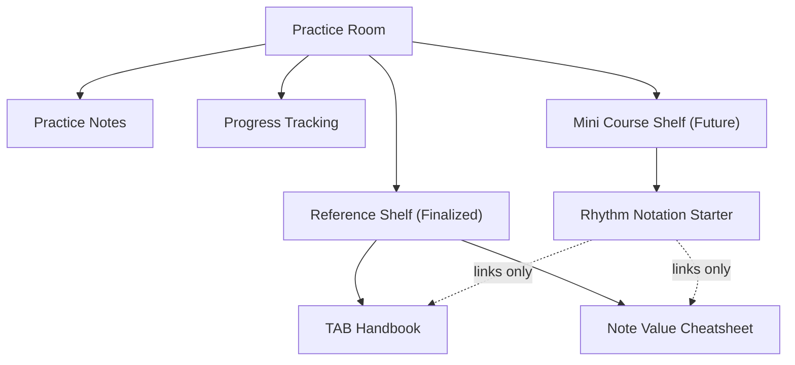

# Mini Course Renderer Plan
Status: Documentation / Renderer Contract / Sprint 5

This document defines the docs-only renderer contract for the future Mini Course Shelf in Guitar Companion. It is not an implementation task.

Current production truth:

- Week 0 Foundation Reset is public.
- Month 1-4 are visible in normal production.
- Month 5-8 remain hidden.
- Reference Shelf is finalized.
- TAB Handbook and Note Value Cheatsheet are finalized.
- Mini Course Shelf is spec-planned only.

Sprint 5 constraint: no production code changes. Do not modify `outputs/` or frozen prototypes.

## 1. Data Shape / Schema

### Root Payload

The future data payload should expose mini courses as a root-level collection, not inside `weeks[]` and not inside Month data.

```json
{
  "miniCourses": [
    {
      "miniCourse": {
        "id": "rhythm-notation-starter",
        "title": "Rhythm Notation Starter",
        "thaiTitle": "อ่านค่าจังหวะ: ตัวดำ ตัวหยุด และจังหวะตก-ยก",
        "status": "draft",
        "visibility": "hidden",
        "placement": "practice-room-mini-course-shelf",
        "optional": true,
        "estimatedMinutesPerDay": 10,
        "totalDays": 7,
        "version": 1
      },
      "modules": [],
      "uiHints": {},
      "audioAssets": []
    }
  ]
}
```

### `miniCourse`

Required fields:

- `id`: canonical kebab-case id, e.g. `rhythm-notation-starter`
- `title`: English technical title
- `thaiTitle`: Thai learner-facing title
- `status`: `draft`, `hidden`, `qa`, or `live`
- `visibility`: `hidden`, `dev-preview`, or `public`
- `placement`: must be `practice-room-mini-course-shelf`
- `optional`: must be `true`
- `estimatedMinutesPerDay`
- `totalDays`
- `version`

Rules:

- Mini course ids must use lowercase kebab-case.
- Mini course ids must not use `month`, `week`, or `module` naming that implies roadmap progression.
- Mini course ids must not collide with Week 0, Month 1-4, Reference Shelf, or Month 5-8 ids.
- Mini courses must never create Month 0.

### `modules[]`

For the first mini course, each module represents one day.

```json
{
  "id": "rhythm-notation-starter-day-1",
  "day": 1,
  "title": "Beat, Bar, and 4/4",
  "thaiTitle": "Beat, ห้องเพลง และ 4/4",
  "durationMinutes": 10,
  "summary": "เรียนรู้ pulse และการนับ 1 2 3 4",
  "blocks": [
    {
      "type": "text",
      "id": "rns-day-1-intro",
      "title": "จังหวะเริ่มจาก pulse",
      "body": "..."
    }
  ],
  "visualCountMap": {
    "count": "1   2   3   4",
    "feel": "หนัก เบา เบา เบา"
  },
  "clapTask": {},
  "guitarTask": {},
  "selfCheck": [],
  "relatedReferences": [],
  "relatedWeeks": [0, 1]
}
```

Allowed block types for Sprint 5 planning:

- `text`
- `teacher-note`
- `count-map`
- `clap-task`
- `guitar-task`
- `mini-tab`
- `self-check`
- `reference-link`

Renderer must gracefully ignore unknown optional block fields and render a fallback card for unknown required block types.

### `uiHints`

`uiHints` controls presentation without changing curriculum meaning.

```json
{
  "uiHints": {
    "surface": "practice-room",
    "tone": "warm-private-teacher",
    "density": "compact",
    "preferredLayout": "stacked",
    "showDayProgress": true,
    "showRelatedReferences": true,
    "mobileScrollableRows": true
  }
}
```

Rules:

- `uiHints` must never override visibility rules.
- `uiHints` must never unlock Month 5-8.
- `uiHints` must never move Reference Shelf content into the lesson flow.

### `audioAssets`

Mini courses may reference internal audio behavior, but must not include external media.

Allowed:

```json
{
  "audioAssets": [
    {
      "id": "rns-metronome-60",
      "type": "internal-metronome",
      "bpm": 60,
      "beatsPerBar": 4
    }
  ]
}
```

Disallowed:

- `mp3`
- `wav`
- remote URLs
- CDN links
- embedded videos
- network-loaded backing tracks
- external audio libraries

Rule: audio must use the existing metronome or internal Web Audio only when implementation is approved.

## 2. Placement

Mini Course Shelf belongs in the Practice Room as optional support material. It must not compete with the Reference Shelf and must not become a main navigation item.

Placement rules:

- Practice Room remains the parent surface.
- Reference Shelf remains finalized and should appear as the reference area.
- Mini Course Shelf should be adjacent to, but visually separate from, Reference Shelf.
- Mini Course Shelf should use compact cards.
- Mini Course Shelf must not be inserted into Week tabs or Month Switcher.

Suggested future Practice Room ordering:

```text
Practice Room
├── Practice Notes
├── Progress Tracking
├── Reference Shelf
│   ├── TAB Handbook
│   └── Note Value Cheatsheet
└── Mini Course Shelf
    └── Rhythm Notation Starter
```

Mermaid placement diagram:



Conflict rules:

- Do not merge Reference Shelf and Mini Course Shelf.
- Do not move `#tabGuidebook` or `#noteValueGuidebook`.
- Mini course cards may link to references, but must not duplicate full reference content.

## 3. Day Selector (1-7)

The Day Selector controls which mini course day is visible.

### States

```text
idle -> openCourse -> selectDay -> completeDay -> nextDay
                         │             │
                         └── resetCourse
```

State definitions:

- `idle`: Mini Course Shelf card is visible but no course is open.
- `openCourse`: Course detail view is open.
- `selectDay`: User selects Day 1-7.
- `completeDay`: User checks self-check criteria for the current day.
- `nextDay`: User moves to next day after completing or manually choosing a day.
- `resetCourse`: User initiates mini course reset flow.

### UX Text

Suggested labels:

- Shelf card CTA: `เปิด Mini Course`
- Day selector label: `เลือกวันที่ฝึก`
- Current day marker: `กำลังฝึก`
- Completed day marker: `ทำแล้ว`
- Locked state: not recommended for this mini course; all 7 days can be selectable
- Empty progress message: `เริ่มจาก Day 1 แบบช้า ๆ ก่อนครับ`

### Edge Cases

- If saved current day is missing, default to Day 1.
- If saved current day is outside 1-7, reset in memory to Day 1 and keep stored value unchanged until next valid save.
- If a day module is missing, show fallback card: `ยังไม่มีข้อมูลสำหรับวันนี้`
- If all days are complete, show completion message but allow review.
- If user opens the course from a reference trigger, keep selected day unchanged.
- If URL hash changes, do not change selected Month.

## 4. Self-Check Progress

Progress storage must be isolated.

Canonical storage key:

```text
gc:mini:{id}:progress:v1
```

Example:

```text
gc:mini:rhythm-notation-starter:progress:v1
```

Stored value:

```json
{
  "version": 1,
  "miniCourseId": "rhythm-notation-starter",
  "currentDay": 3,
  "completedDays": [1, 2],
  "selfCheckByDay": {
    "1": [true, true],
    "2": [true, false, true]
  },
  "updatedAt": "2026-07-03T00:00:00.000Z"
}
```

Storage rules:

- Must not use Week 0 checklist prefixes.
- Must not use Month 1-4 completion keys.
- Must not write to `selectedFocusedMonth`.
- Must not update Practice Notes.
- Must not store Reference Shelf open/closed state.

Migration plan:

- `v1` is the first version.
- The old underscore-style storage prefix `gc_mini_course_rhythm_notation_starter_` is a planning artifact only.
- The accepted v1 key is `gc:mini:{id}:progress:v1`.
- If no stored progress exists, initialize in memory only until the user checks an item or selects a day.
- If malformed JSON is found, ignore it and show a non-blocking fallback message.
- If future `v2` exists later, keep a read-only parser for `v1` before writing `v2`.
- Renderer must never delete unknown localStorage keys outside the mini-course namespace.

## 5. Reset Behavior

Mini Course reset is separate from the main Month reset.

Locked decision:

- Main reset does not clear Mini Course progress by default.
- Main reset UI must include contextual copy explaining that Mini Course progress has its own reset.
- Each Mini Course has its own reset control.
- If progress is more than 50% complete, reset requires type-to-confirm.
- Confirmation phrase: `RESET MINI COURSE`

### Progress Percentage

For a 7-day mini course:

```text
progressPercent = completedDays.length / 7 * 100
```

Type-to-confirm applies when:

```text
progressPercent > 50
```

For Rhythm Notation Starter, this means completed days greater than 3 of 7.

### API Contract

Future renderer functions:

```js
getMiniCourseProgress(courseId)
saveMiniCourseProgress(courseId, progress)
resetMiniCourseProgress(courseId, options)
requiresMiniCourseResetConfirmation(progress)
```

`resetMiniCourseProgress(courseId, options)` contract:

```json
{
  "courseId": "rhythm-notation-starter",
  "confirmPhrase": "RESET MINI COURSE",
  "confirmed": true,
  "source": "mini-course-reset-control"
}
```

Must not affect:

- `selectedFocusedMonth`
- Month progress bars
- Week 0 checklist state
- Practice Notes
- Reference Shelf state
- Month 5-8 visibility

### Modal Texts

Normal reset:

- Title: `ล้างความคืบหน้า Mini Course นี้หรือไม่?`
- Body: `การล้างนี้มีผลเฉพาะ Mini Course นี้เท่านั้น ไม่กระทบ Month 1-4, Week 0 หรือบันทึกการซ้อม`
- Confirm button: `ล้าง Mini Course`
- Cancel button: `ยกเลิก`

Type-to-confirm reset:

- Title: `ยืนยันการล้าง Mini Course`
- Body: `คุณทำ Mini Course นี้ไปเกินครึ่งแล้ว ถ้าต้องการล้างจริง ให้พิมพ์ RESET MINI COURSE`
- Input label: `พิมพ์ข้อความยืนยัน`
- Confirm button: `ล้าง Mini Course`
- Disabled hint: `พิมพ์ข้อความให้ตรงก่อนครับ`

Main reset contextual copy:

```text
Mini Course progress is separate. Use the Mini Course reset inside each mini course if you want to clear it.
```

## 6. Data-Scroll Integration

Mini Course renderer should reuse existing data-scroll behavior for reference links.

Allowed targets:

- `#tabGuidebook`
- `#noteValueGuidebook`

Example:

```json
{
  "type": "reference-link",
  "label": "เปิดคู่มือ TAB",
  "target": "#tabGuidebook"
}
```

Rules:

- Use existing `data-scroll` behavior when target exists.
- Opening a mini course reference link may expand the related Reference Shelf section.
- Do not duplicate TAB Handbook or Note Value content in mini course modules.
- Do not create new reference routes in Sprint 5.

Fallback rules:

- If target is missing, render disabled button text: `ยังไม่พบคลังอ้างอิงนี้`
- If target is hidden by production scope, render plain text reference only.
- If JavaScript fails, links must not break lesson content.

## 7. Mobile Layout

Target widths:

- 390px
- 430px

Layout rules:

- Mini Course Shelf card stacks vertically.
- Day selector uses horizontal scroll or wrapped chips, never body-level overflow.
- Course detail view uses one column.
- Count maps use monospace text inside scrollable boxes.
- Action buttons stack when needed.
- Self-check items remain tappable.

Recommended sizing:

- Outer card padding: 16px at mobile
- Inner task card padding: 14px
- Body font size: 15-16px
- Caption font size: 13-14px
- Count map font size: 13px minimum
- Button minimum height: 44px
- Chip minimum tap target: 40px

Accessibility:

- Do not rely on color only for completed/current day.
- Use `aria-current="step"` for current day or `aria-pressed` on day buttons.
- Ensure focus moves into course detail when opened.
- Preserve visible focus outlines.
- Respect `prefers-reduced-motion`.

Mobile failure condition:

- Any `document.documentElement.scrollWidth > document.documentElement.clientWidth` caused by Mini Course renderer fails QA.

## 8. Fallback Rules

Renderer must fail softly.

### Missing Mini Course

Message:

```text
ยังไม่มี Mini Course ให้เปิดในตอนนี้
```

Behavior:

- Hide detail view.
- Keep Practice Room usable.

### Empty `modules[]`

Message:

```text
Mini Course นี้ยังไม่มีบทฝึกครับ
```

Behavior:

- Show shell card and status.
- Do not render day selector.

### Missing Day Module

Message:

```text
ยังไม่มีข้อมูลสำหรับวันนี้
```

Behavior:

- Keep day selector visible.
- Do not crash.

### Missing Audio

Message:

```text
ใช้ Metronome ด้านบนแทนเสียงตัวอย่างได้เลยครับ
```

Behavior:

- Hide audio controls.
- Keep clap/guitar task visible.

### Missing Fretboard Visual

Message:

```text
บทนี้ยังไม่ต้องใช้แผนภาพคอกีตาร์
```

Behavior:

- Skip fretboard area.
- Keep count map and tasks visible.

### Missing Self-Check

Message:

```text
เช็กตัวเองด้วยคำถามสั้น ๆ: วันนี้นับได้ตรงขึ้นไหม?
```

Behavior:

- Render one fallback reflection prompt.

## 9. Error Codes & Events

### Error Codes

| Code | Meaning | User-Facing Behavior |
| --- | --- | --- |
| `MC_NO_COURSES` | No mini courses available | Show empty shelf message |
| `MC_COURSE_NOT_FOUND` | Requested course id missing | Return to shelf |
| `MC_EMPTY_MODULES` | Course has no modules | Show empty course card |
| `MC_DAY_NOT_FOUND` | Selected day missing | Show missing day fallback |
| `MC_PROGRESS_PARSE_FAILED` | localStorage JSON malformed | Ignore stored value and continue |
| `MC_PROGRESS_SAVE_FAILED` | localStorage write failed | Show non-blocking warning |
| `MC_RESET_CONFIRM_MISMATCH` | Type-to-confirm phrase incorrect | Keep modal open |
| `MC_REFERENCE_TARGET_MISSING` | data-scroll target missing | Render disabled reference control |
| `MC_AUDIO_UNAVAILABLE` | Internal audio unavailable | Fall back to metronome instruction |
| `MC_UNKNOWN_BLOCK_TYPE` | Unsupported block type | Render fallback block |

### Emitted Events

Future renderer may dispatch CustomEvents for debug/QA only:

```js
window.dispatchEvent(new CustomEvent("gc:mini-course:open", { detail }));
window.dispatchEvent(new CustomEvent("gc:mini-course:day-change", { detail }));
window.dispatchEvent(new CustomEvent("gc:mini-course:progress-save", { detail }));
window.dispatchEvent(new CustomEvent("gc:mini-course:reset", { detail }));
window.dispatchEvent(new CustomEvent("gc:mini-course:error", { detail }));
```

Event detail examples:

```json
{
  "courseId": "rhythm-notation-starter",
  "day": 3,
  "source": "day-selector"
}
```

Rules:

- Events must not expose private notes.
- Events must not send data over network.
- Events are local browser events only.
- Events must not mutate Month visibility.

## 10. Gating Checklist

The following must be approved before implementation:

- Mini Course data shape is accepted.
- `gc:mini:{id}:progress:v1` progress storage key is accepted.
- Separate reset behavior is accepted.
- Type-to-confirm threshold over 50% is accepted.
- Confirmation phrase `RESET MINI COURSE` is accepted.
- Main reset contextual copy is accepted.
- Data-scroll integration with TAB / Note Value is accepted.
- Mobile layout rules for 390px and 430px are accepted.
- Fallback messages are accepted.
- Error codes and event names are accepted.
- No changes to Reference Shelf content are required.
- No production UI is implemented in Sprint 5 docs phase.
- Month 5-8 remain hidden.
- Month 0 is not created.
- Frozen prototypes remain untouched.

Implementation may begin only after this checklist is explicitly approved.
